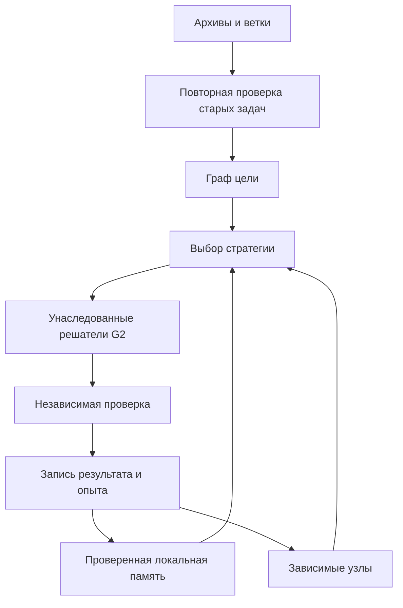

# YADO Unified Causal Graph V1

Новая архитектура объединяет действующее ядро G2, Successor V2, все доступные ветки Git и архивы предыдущих сборок. Автор интеграции и нового управляющего кода — ассистент. Нативные решатели, используемые для выполнения и синтеза, унаследованы от YADO.

## Изменение архитектуры

Единица работы — ограниченный ориентированный ациклический граф задач. Узел содержит тип возможности, входные данные, бюджет, зависимости, привязки результатов и необязательное ожидаемое значение. Данные предыдущего узла становятся доступны зависимому узлу после проверки. Задачи пользователя получают приоритет перед повторением опыта и внутренними задачами.



Все переходы записываются в существующий SQLite-журнал Successor с цепочкой хешей. После перезапуска из событий восстанавливаются графы, результаты, статистика выбора и реестр созданных модулей. Отдельного конкурирующего реестра состояния нет. Прежний API `python -m successor` сохранён.

## Возможности

| Контракт | Исполнение | Проверка |
|---|---|---|
| `relation` | Нативная логика либо маршрутизатор | Независимое транзитивное замыкание |
| `events` | Нативная обработка событий либо маршрутизатор | Независимый стек вложенности Q/R |
| `numeric` | Полиномы степени 1–3 | Детерминированная отложенная часть примеров |
| `source_synthesis` | Нативный синтез выражения и материализация Python | Грамматика, хеш, согласованность IR и отложенные примеры |
| `source_apply` | Ранее допущенный модуль по SHA-256 | Независимый интерпретатор арифметического IR |
| 10 `native:*` | Совместимые операции прежнего ядра | Явное ожидаемое значение либо `EXECUTED_UNVERIFIED` |

Созданные программы имеют форму `def yado_generated_capability(x, y): return ...`. Язык включает переменные, ограниченные константы и операции `+`, `-`, `*`. Синтез ограничен тремя операциями. Выбор и реализация этой формы основаны на нативном синтезаторе YADO и опыте исходного транспорта Endogenous V3. Успех на отложенных примерах обозначается `VALIDATED_ON_HOLDOUT`; это не доказательство правильности функции на произвольных данных. Повторное применение подтверждает соответствие сохранённой программе.

## Опыт и объединение исходников

`experience/unified-assembly-20260912/merge-resolution.json` фиксирует объединение веток и семь конфликтов. Точные альтернативные файлы сохранены рядом. Восстановлены модули external-data, отсутствовавшие в дереве main после объединения только истории.

Сборщик фиксирует все доступные ссылки Git и проверяет, что их коммиты входят в собранную ветку. Архив сохраняет все достижимые объекты, включая удалённые ранее файлы. Дополнительно он проверяет и импортирует базы опыта из обеих поставок Successor V2, сохраняет Endogenous V3 и внешний отчёт. Модули группируются по хешу с привязкой к веткам, рабочим путям, символам и локальным импортам. Старые альтернативы сохраняются как исходные данные; активными остаются явно зарегистрированные компоненты.

Старые статусы PASS не прибавляют успешных наблюдений. Из проверенных журналов извлекаются исходные задачи. Команда `rehearse` ставит их в очередь, а `run` выполняет заново. Повторение одинакового входа, ожидания и стратегии не увеличивает статистику. Результаты без независимого ожидания не обучают модель выбора и не разрешают зависимые задачи.

## Запуск

Требуется Python 3.12, полный клон Git и зависимости `successor/requirements.txt`. Используйте версию исходников, указанную в манифесте поставки: изменение закреплённых файлов требует новой сборки.

```bash
python -m pip install -r successor/requirements.txt
python -m successor.unified build --output /absolute/new-birth
python -m successor.unified submit --manifest /absolute/new-birth/manifest.json --state /absolute/session.sqlite --input /absolute/goal.json
python -m successor.unified run --manifest /absolute/new-birth/manifest.json --state /absolute/session.sqlite --max-steps 100
python -m successor.unified status --manifest /absolute/new-birth/manifest.json --state /absolute/session.sqlite
```

Для сборки с внешним опытом добавьте `--external-root /absolute/inputs --catalog experience/unified-assembly-20260912/input-catalog.json`. Файлы должны соответствовать каталогу поставки.

Пример `goal.json` с передачей реального результата:

```json
{
  "goal": "Связать достижимость с проверкой событий",
  "nodes": [
    {"id": "reach", "capability": "relation", "input": {"relation": [["a", "b"], ["b", "c"]], "start": "a"}},
    {"id": "nesting", "capability": "events", "input": {"events": [["Q", ""], ["R", ""]]},
     "bindings": [
       {"from": "reach", "path": ["answer", 1], "to": ["events", 0, 1]},
       {"from": "reach", "path": ["answer", 1], "to": ["events", 1, 1]}
     ]}
  ]
}
```

Команды `stop --goal-id ID`, `rehearse --limit 12` и `export --output /absolute/new-export` используют те же параметры манифеста и состояния. Экспорт создаёт исходные `.py` для допущенных модулей. Фонового бесконечного процесса нет: число переходов задаётся явно.

## Воспроизводимая проверка

```bash
YADO_SUCCESSOR_TEST_MANIFEST=/absolute/birth/manifest.json python -m unittest successor.tests.test_unified_contracts successor.tests.test_unified_graph -v
python runtime/yado_full_kernel_audit_v1.py
python runtime/yado_full_regression_v1.py --manifest /absolute/birth/manifest.json --output /absolute/regression.json
python -m successor.evaluation.run_unified_acceptance --manifest /absolute/birth/manifest.json --output /absolute/new-acceptance
```

Не изменяйте закреплённые исходники во время прогона. Аудитор регрессии отдельно проверяет отсутствие дрейфа исходного кода. Приёмка содержит новые композиционные задачи и новые запросы к сохранённым программам; ответы вычисляются вне ядра. Её область — эти ограниченные контракты, а не общий интеллект или установленное сознание. Итоговые результаты публикуются в `audits/unified-20260912/REPORT_RU.md`.
